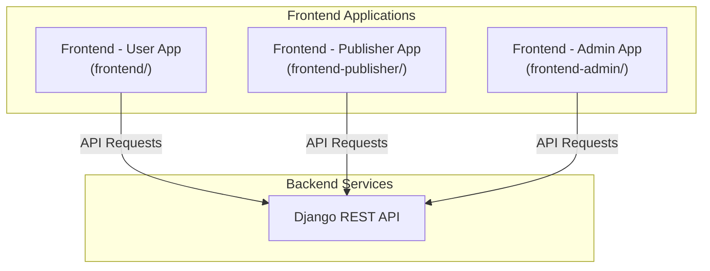

# WebGame Platform  
  
A comprehensive web-based gaming platform with separate interfaces for users, publishers, and administrators.  
  
## Project Overview  
  
WebGame is a full-stack application that allows users to browse, purchase, and play games online. The platform consists of three separate frontend applications and a backend API:  
  
1. **User Application** - For regular users to browse, purchase, and play games  
2. **Publisher Application** - For game publishers to manage their games and profiles  
3. **Admin Application** - For administrators to oversee the platform  
  
## Architecture  
  

# Technology Stack

- **Frontend:** Next.js (React-based framework)
- **Styling:** Tailwind CSS
- **Backend:** Django REST API
- **Authentication:** JWT-based authentication

# Getting Started

## Prerequisites

- Node.js (v14 or higher)
- npm
- Python (for backend)

## Backend Setup

1. **Clone the repository:**

   ```bash
   git clone https://github.com/LinH8a211/WEBgame.git
   cd WEBgame
   ```
2. **Create a virtual environment:**

   For user application:
   ```bash
   python -m venv venv  
   source venv/bin/activate  # On Windows: venv\Scripts\activate
   ```
3. **Install dependencies:**

   ```bash
   pip install -r requirements.txt
   ```
4. **Run migrations:**

   ```bash
   python manage.py migrate
   ```
5. **Start the development server:**

   ```bash
   python manage.py runserver
   ```

## Frontend Setup
1. **Install dependencies for each frontend application:**

   For user application:
   ```bash
   cd frontend  
   npm install
   ```
   For publisher application:
   ```bash
   cd frontend-publisher 
   npm install
   ```
   For admin application:
   ```bash
   cd frontend-admin  
   npm install
   ```
2. **Run the development server for any of the applications:**

   ```bash
   npm run dev  
   ```
3. **Open http://localhost:3000 with your browser to see the user result (3001 for admin, 3002 for publisher).**


   
